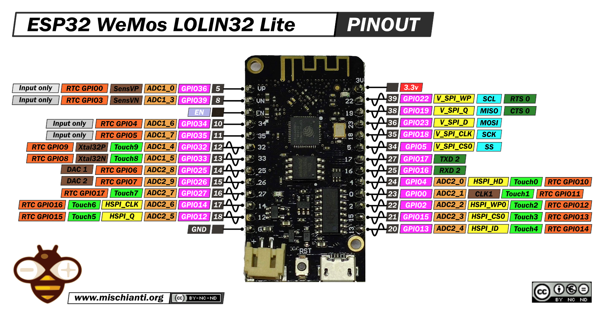

# Hardware Considerations

## UAV Controller Requirements

- Arduino support
- 32 bit processor
- At least 21 GPIO pins for:
  - 3x UART: Receiver, GPS, spare/debug (6 pins)
  - 1x SPI: fast IMU (4 pins)
  - 1x I2C: Magnetometer, Barometer, Current sensor, slow IMU (2 pins)
  - 1x IMU interrupt pin
  - 8x PWM: Motor, Servo (8 pins)
  
## Default madflight Controller Boards

| Board | ESP32 DevKitC | ESP32-S3 DevKitC | Raspberry Pi Pico (W) | Black Pill |
| --- | :-: | :-: | :-: | :-: |
Board Size | 55 * 28 mm | 69 * 26 mm | 51 * 21 mm | 53 * 21 mm
Board Weight | 6.9 g (9.1 g with headers) | 8.4 g (10.9 g with headers) | 3.0 g | 4.5 g
Board Pins | 38 pins | 44 pins | 40 pins | 40 pins
Available external GPIO pins | 21 + 4 input only + 1 button: 0 Note: strap pin restrictions | 25 + 7 external pins but used: Button: 0 OSPI: 35, 36, 37 RGB LED: 38 USB: 19, 20 Note: strap pin restrictions | 26 Internal only: Power save: 23 VBUS monitor: 24 LED: 25 VSYS voltage: 29 ADC3 | 30 + 2 external but used: Button: PA0 LED: PC13
PWM | 16 (8 LEDC timers each with 2 output pins) | 8 (4 LEDC timers each with 2 output pins) | 16 (8 timers each with 2 output pins) | 25 (6 * 16bit + 2 * 32bit timers)
Available UART | 3 | 3 | 6 (2 + 4*PIO) +USB Serial debug | 3
Available SPI | 2 | 2 | 2 | 5
Available I2C | 2 | 2 | 2 | 2
Available ADC pins | 16 (12bit) | 20 (12bit) | 3 (12bit) | 10 (12bit)
On Board Peripherals | WIFI + BT + Button | WIFI + BT + Button + RGB LED | LED + WIFI/BT (W) | Button + LED (+ optional SPI flash)
MCU | ESP32 | ESP32S3 | RP2040 | STM32F411CE/CC
MCU GPIO | 34 | 45 | 30 | 32
Processor | 2 * 240MHz LX6 | 2 * 240MHz LX7 | 2 * 133MHz M0+ | 1 * 100MHz M4
Coremark (single core) | 351 | | 228 | 172
FPU | FPU | FPU | no FPU | FPU
MFLOPS (*) | 63 | 61 | 2.0 | 48
RAM | 320K data 132K instruction 64K cache | 320K data 128K instruction 64K cache | 264K data/instr. 16K XIP cache | 128K
Flash | 2-16M QuadSPI | 2-16M OctalSPI | 2M QuadSPI | 512K internal (CE) 256K internal (CC)
PSRAM | 0-8M | 0-8M | 0 | 0
Board price single piece | $4 | $5 | $4 | $3

(*) MFLOPS (million floating point operations per second) results with TestFLOPS program in tools folder

Other boards:
|Board|MCU|Specs|IO|Size|Weight|Price|
|-|-|-|-|-|-|-|
Waveshare RP2040-Zero | RP2040 | 2MB flash, RESET+BOOT button, RGB LED | 20 io + 9 via solder points | 23 * 17 mm | 1.7 gr | $3
WeMos LOLIN32-Lite | ESP32 | 4MB flash, 0MB PSRAM, RESET button, lipo charger, LED | 23 io | 50 * 25 mm | 4.7 gr | $3
WeMos LOLIN S3 Mini | ESP32-S3 | 4MB flash, 2MB PSRAM, RESET+BOOT button, LED | 27 io | 34 * 25 mm | 3 gr | $5
WeAct STM32F405 Core Board | STM32F405RGT6 | 1MB flash, 192kB RAM, 168MHz, 6 UART, RESET+BOOT+USER button, LED, SDCARD | 45 io | 42 * 25 mm | | $8
WeAct STM32H743 Core Board | STM32H743VIT6 | 2MB flash, 1MB RAM, 480MHz, 8 UART, RESET+BOOT+USER button, LED, SDCARD, 8MB SPI Flash, LCD, DVP | 77 io | 67 * 41 mm | | $16

### ESP32

### ESP32S3

### RP2040

### STM32F411

